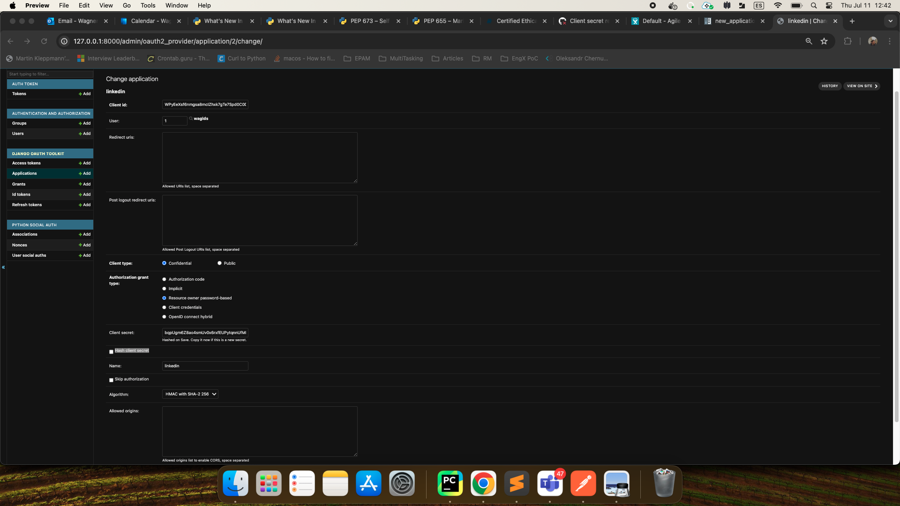

.. _new-application:

Setting Up a New Application
============================

To begin, navigate to the Django admin panel and create a new application with the following configuration:

- Leave the `client_id` and `client_secret` fields unchanged.
- Set the `user` field to your superuser.
- Leave the `redirect_uris` field blank.
- Set the `client_type` field to confidential.
- Set the `authorization_grant_type` field to 'Resource owner password-based'.
- Optionally, you can set the `name` field to a name of your choice.

With these settings in place, the installation is now complete and you can proceed to test the newly configured application.

For further information and to take full advantage of the capabilities of this package, it is highly recommended
that you refer to the documentation for python-social-auth and django-oauth-toolkit.
If you intend to enable a social backend such as Facebook, you may want to consult the python-social-auth
documentation on `supported backends <http://python-social-auth.readthedocs.io/en/latest/backends/index.html#supported-backends>`_
and the django-social-auth documentation on `backend configuration <http://python-social-auth.readthedocs.io/en/latest/configuration/django.html>`_.

Screenshot of the new application creation.

