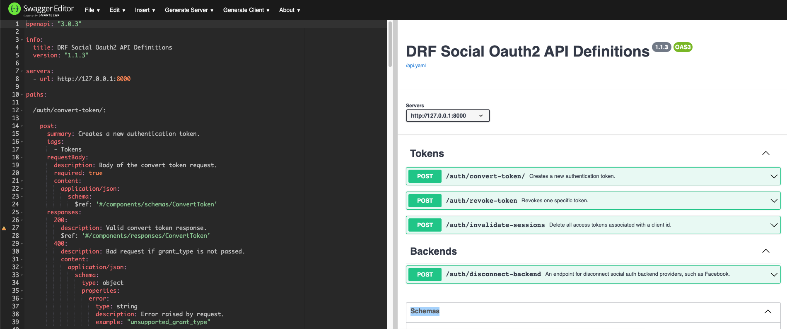

OpenAPI Specs
=============

To interact with your API and make requests, you can utilize the Swagger Editor. The following commands will
enable you to run the Swagger Editor and begin interacting with your API.

For Mac and Linux users, run the following command:

.. code-block:: console

    $ docker run --rm -p 8080:8080 -v $(pwd):/tmp -e SWAGGER_FILE=/tmp/api.yaml swaggerapi/swagger-editor

For Windows users, run the following command:

.. code-block:: console

    $ docker run --rm -p 8080:8080 -v ${pwd}:/tmp -e SWAGGER_FILE=/tmp/api.yaml swaggerapi/swagger-editor

You don't need to build your own requests from scratch, as both curl commands and the Swagger interface are
provided. With these tools at your disposal, you can easily interact with your API and test its functionality.

You can access the Swagger application by visiting http://localhost:8080.

The Swagger console looks like this:

